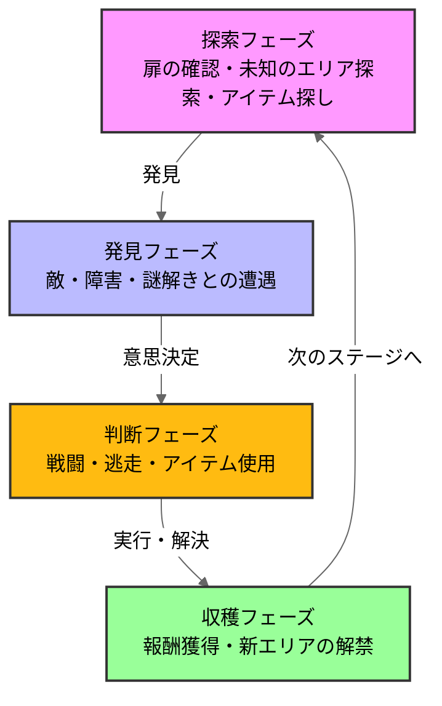
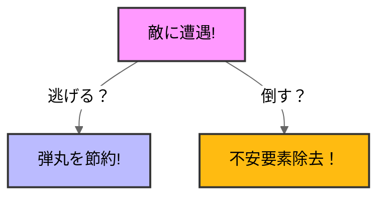

# バイオハザード RE2

## ゲーム概要、選定理由
### ゲーム概要

全てがプレイヤーの想像を裏切り上回る。\
1998年9月にラクーンシティを襲った生物災害。ゾンビが生者を引き裂く地獄から生還せよ。 \
(steamstoreページより)

### 選定理由
私が初めてクリアしたホラーゲームだから。\
他のゲームジャンルでは得られない楽しさを感じたため。\

## 分析の流れ
### 1.ゲームループ
ループ図解...このゲームがどんな行動を繰り返すか\
おもしろさのポイント

## 分析
### 1.ゲームループ
### ループ図解

バイオハザードRE2のゲームループは探索、遭遇、判断、収穫の4つのフェーズで構成される。\
このループが「極限サバイバル体験」を実現している

##おもしろさのポイント
このゲームの面白さを設計の観点から考察していく

### リソース不足設計
バイオハザードRE2の面白さの一つ目は圧倒的なリソース不足設計です。
ここで言う「リソース」とは銃を撃つために必要な銃弾やハーブ(回復薬)などの必須アイテム、インベントリの上限のことを指しています
 
 

例えば、このゲームの銃弾はかなり少ない量しか入手できないようになっています。
この設定がプレイヤーの行動に迷いを発生させています。

リソースを消費して不安から解放されるか、リスクの上で逃げることを選ぶか、この判断をさせることこそが面白さの要因

### 邪魔なゾンビ

