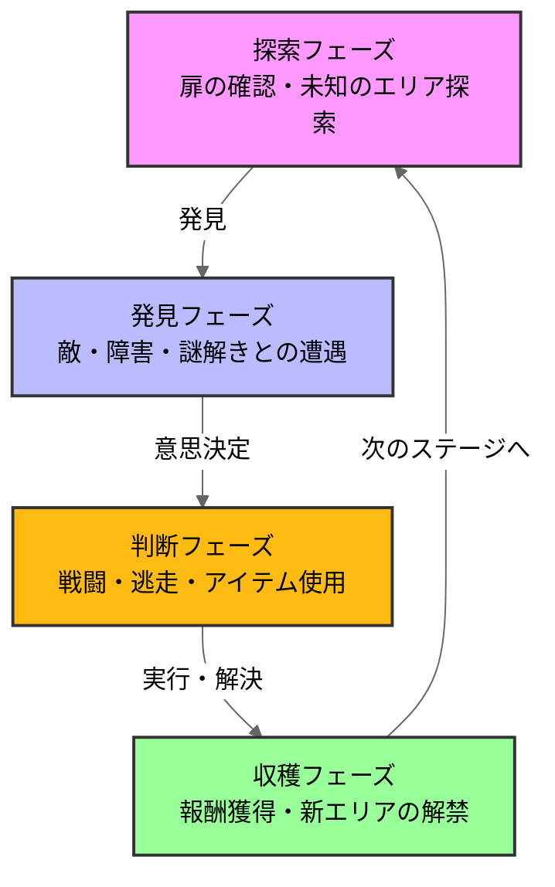

# バイオハザード RE2

## ゲーム概要、選定理由
### ゲーム概要

全てがプレイヤーの想像を裏切り上回る。\
1998年9月にラクーンシティを襲った生物災害。ゾンビが生者を引き裂く地獄から生還せよ。 \
(steamstoreページより)

### 選定理由
私が初めてクリアしたホラーゲームだから。\
他のゲームジャンルでは得られない楽しさを感じたため。\

## 分析の流れ
### 1.ゲームループ
ループ図解...このゲームがどんな行動を繰り返すか\
設計意図の考察...なぜこのループが設計されているか\
体験との紐づけ...この設計がプレイヤーにどんな感情を生むか

## 分析
### 1.ゲームループ
### ループ図解

バイオハザードRE2のゲームループは探索、遭遇、判断、収穫の4つのフェーズで構成される。\
特に判断フェーズでは、リソースの不足により常に正解のない選択を迫れる。\
なので単純な戦闘ゲームではなく、本格的な生存戦略を体験できるような設計がなされている。

### 設計思想
このゲームループに設計した目的はバイオ世界特有の「極限サバイバル」をプレイヤーに体感してもらうという意図があると考えます。\
特に私は「リソース不足」が「極限サバイバル」を体感させる大きな要因だと考えています\

### リソース不足設計
ここで言う「リソース」とは銃を撃つために必要な銃弾やハーブ(回復薬)などの必須アイテム、インベントリの上限のことを指しています
 
 

リソース不足が極限サバイバルを際立たせる例として敵を銃で倒すことを想定してみましょう。\
このゲームはゾンビを倒すには銃を使うことが最適解です。\
ゾンビはマップの至る所に配置されており、プレイヤーの行く手を阻んいるので当然のことですがそれらを倒さなければなりません。\
 
ですがここでリソースの問題が出てきます。\
銃弾は有限であるという点です。\
銃弾はマップの至る所から拾ってこなければならず、一回で拾える銃弾は6~10発ほど。\
そして敵を倒すには3～5発ほど頭に当てなければ倒すことができません。

 
つまり、出会った敵すべてを倒していくと銃弾はなくなってしまうわけです。

 
結果的にプレイヤーは倒して安心するか、銃弾を節約して逃げるかの判断に迫られます

この判断が、生存しているという感覚を感じさせる要因になっている。

