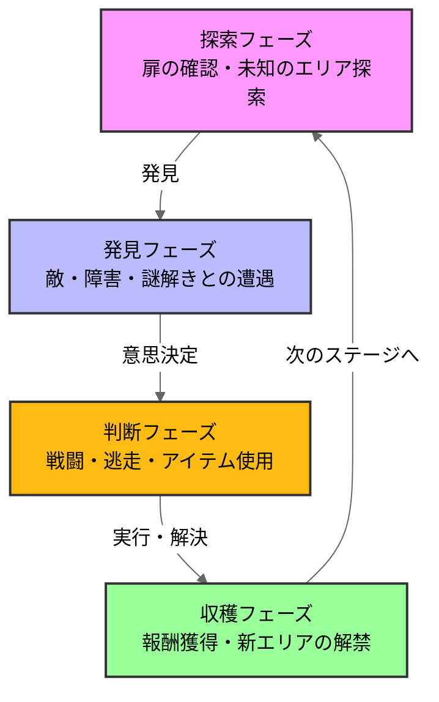

# バイオハザード RE2

## ゲーム概要、選定理由
私が初めてクリアしたホラーゲームで他のゲームジャンルでは得られない楽しさを感じたため\
対象:レオン編

## 分析の流れ
### 1.ゲームループ
ループ図解...このゲームがどんな行動を繰り返すか\
設計意図の考察...なぜこのループが設計されているか\
体験との紐づけ...この設計がプレイヤーにどんな感情を生むか

##分析
### 1.ゲームループ
### ループ図解

### 設計思想
このゲームループに設計した目的はバイオ世界特有の「極限サバイバル」をプレイヤーに体感してもらうという意図があると考えます。\
一般的に「作りこまれた世界観を探索する」といったことが極限サバイバルを感じる上で重要です。\
ですが、私は世界観よりも「リソース不足」が「極限サバイバル」を体感させる大きな要因だと考えています\

### リソース不足設計
ここで言う「リソース」とは銃を撃つために必要な弾丸やハーブ(回復薬)などの必須アイテム、インベントリの上限のことを指しています

所持できるアイテムが制限されている\
↓↓↓↓↓↓↓↓↓↓↓↓↓↓↓

