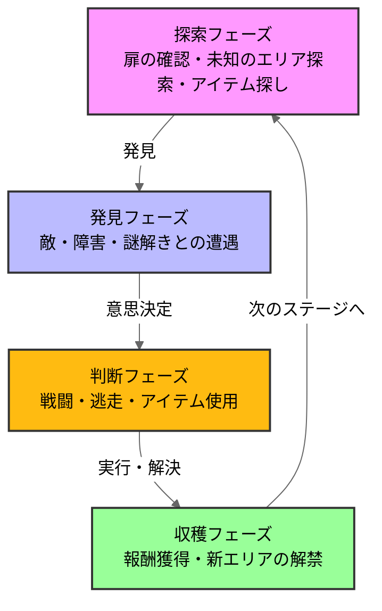
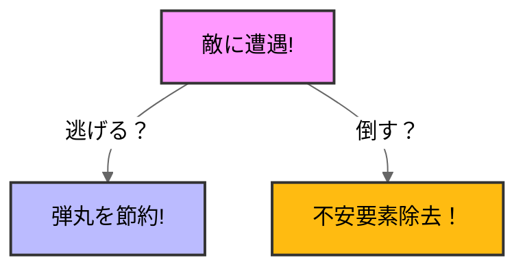

# バイオハザード RE2

## ゲーム概要、選定理由
### ゲーム概要

全てがプレイヤーの想像を裏切り上回る。\
1998年9月にラクーンシティを襲った生物災害。ゾンビが生者を引き裂く地獄から生還せよ。 \
(steamstoreページより)

### 選定理由
私が初めてクリアしたホラーゲームだから。\
他のゲームジャンルでは得られない楽しさを感じたため。\

## 分析の流れ
ゲームループ
おもしろさのポイント

## 分析
### 1.ゲームループ
### ループ図解

バイオハザードRE2のゲームループは探索、遭遇、判断、収穫の4つのフェーズで構成される。\
このループが「極限サバイバル体験」を実現している

##おもしろさのポイント
このゲームの面白さを設計の観点から考察していく

### リソース不足設計
バイオハザードRE2の面白さの一つ目は圧倒的なリソース不足設計です。
ここで言う「リソース」とは銃を撃つために必要な銃弾やハーブ(回復薬)などの必須アイテム、インベントリの上限のことを指しています
 
 

このゲームのリソースは必ず足らなくなるように設計されています。
例えば、ゾンビを倒す際に必要な銃弾。このゲームのゾンビを倒すには3～5発弾が必要になってきます。\
ですがそれに見合った弾数が配布されず、配布されたとして10発。
 

プレイヤーはこの最小のリソース下でゲームを攻略していかなければなりません。\
そして私はこれがこのゲームを面白くする設計だと考えます。

リソースが少なくなると分かるとプレイヤーに迷いが生じます。
以下は、敵に出会ったときどう対処するかの例です。

プレイヤーは敵に遭遇したら倒して不安要素を取り除くか、上手くやり過ごして銃弾を節約するかの判断に迷い生じます。\
どちらの選択をしたとしても正確な正解がない、自分の考えるように脱出させるという思考の誘導こそがこのゲームの面白さを際立てさせています。

###ストレス設計
前提として私は「かけられたストレスを解消する」ということがゲームの面白さの核だと考えています。\
これは心理学的に、快感の大きさは直前の不快感と緊張の強さに比例するという側面があるからです。\

このゲームの「ストレス」はあらゆるところに潜んでいます。
ここでは前述に出た銃弾の少なさとゾンビやボスなどの敵の威圧感の2点から分析していこうと思います。

### 銃弾の少なさ \
前述でも述べたようにこのゲームでは敵を倒すのに必要な段数に対して、手に入れる段数の量がギリギリに設定されています. \
 

プレイヤーは銃を撃つたびにリソース問題への不安を抱え続けなければなりません。\
これを使いきったら次はないかもしれない
ここに画像

この「枯渇への恐怖」が、探索中へのあらゆる事柄に対し過敏な警戒心を生みだし、一発の命中、予期せぬ弾薬の発見に対して、通常以上の安堵感をもたらす仕掛けになっています。

### ゾンビやボスの威圧感\
このゲームのボスキャラクターはビジュアルの不気味さだけでなく、プレイヤーの物理的な領域を侵食し、逃げ場を奪う絶対強者として描かれています。\
特に、

