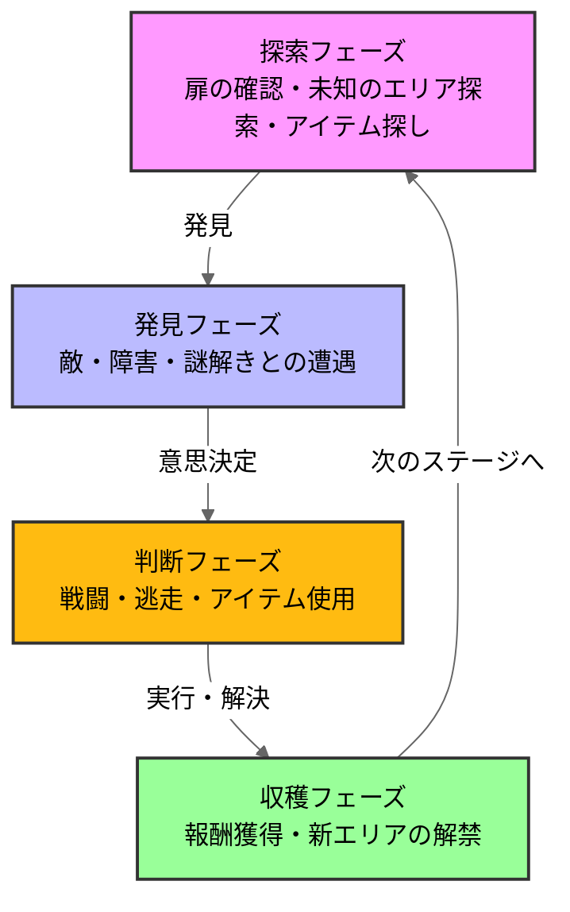
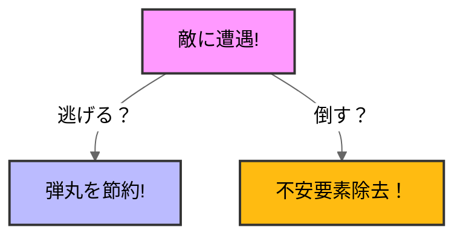

# バイオハザード RE2

## ゲーム概要、選定理由
### ゲーム概要

全てがプレイヤーの想像を裏切り上回る。\
1998年9月にラクーンシティを襲った生物災害。ゾンビが生者を引き裂く地獄から生還せよ。 \
(steamstoreページより)

### 選定理由
私が初めてクリアしたホラーゲームだから。\
他のゲームジャンルでは得られない楽しさを感じたため。\

## 分析の流れ
### ゲームループ
ゲームのコアループ・メタループを図解

### おもしろさのポイント
私が考えるこのゲームの面白さの核心

### ターゲットプレイヤーと体験設計
誰のためにどんな体験を届けるゲームか

### 考察・まとめ
私がゲームから得た気づきをまとめる

## 1.ゲームループ
### ループ図解

バイオハザードRE2のゲームループは探索、遭遇、判断、収穫の4つのフェーズで構成される。\
このループが「極限サバイバル体験」を実現している

## おもしろさのポイント
このゲームの面白さを設計の観点から考察していく

### リソース不足設計
バイオハザードRE2の面白さの一つ目は徹底したリソース不足設計です。
ここで言う「リソース」とは銃を撃つために必要な銃弾やハーブ(回復薬)などの必須アイテム、インベントリの上限のことを指しています
 
 

このゲームのリソースは必ず足らなくなるように設計されています。
例えば、ゾンビを倒す際に必要な銃弾。このゲームのゾンビを倒すには3～5発弾が必要になってきます。\ですがそれに見合った弾数が配布されず、弾薬がギリギリになるように設計されています。\
 

プレイヤーは常に最小のリソース下でゲームを攻略していかなければなりません。\

このリソース不足こそが、このゲームの面白さを生む設計だと考えています。\

これは弾数が少ないと認識した瞬間、プレイヤーは敵との遭遇ごとに判断を迫られるからです。

プレイヤーは敵に遭遇したら、倒して不安要素を取り除くか、上手くやり過ごして銃弾を節約するか2択で判断しなければなりません。ですがこの2択には明確な正解がありません。どちらを選ぶべきかはプレイヤー自身の判断に委ねられており、「その自分の頭で考えて切り抜けるという体験」こそが、このゲームの面白さを際立たせています。

###ストレス設計
前提として私は「かけられたストレスを解消する」ということがゲームの面白さの核だと考えています。\
これは心理学的に、快感の大きさは直前の不快感と緊張の強さに比例するという側面があるからです。\

本作におけるストレスの源は主に2つ。\
ひとつは前述のリソース不足、もう一つは敵と遭遇し続けることで生じる恐怖です。\
この2つは独立しているわけではなく互いに強めあう関係にあり、弾が少ないから敵が怖く、敵が怖いから弾を使う事への躊躇が生まれます。\
 
そしてプレイヤーがこの2重のストレスから解放される瞬間、難所を切り抜けた瞬間、ボスを倒した瞬間にゲームとしての快感が最高潮に達します。\
このリソース不足と恐怖はこのゲームの主要な「ストレス」であり、解放感を最大化するために設計された仕組みであると考えます。

# ターゲットプレイヤーと体験設計

##ターゲットプレイヤー
このゲームのターゲット層は\
バイオハザードシリーズファン\
サバイバルアクションを求めるプレイヤー\
ホラー体験を求めるプレイヤー\

 
の３つの分けられます。\
 
### シリーズファン
本作はバイオハザード2のリメイクという立場から、オリジナル版を知るプレイヤーに再体験の価値を提供しています。\
現代のグラフィックと操作感で刷新しながらも、ラクーンシティや登場人物といった世界観の核心は忠実に再現されており、シリーズへの親しみがそのまま没入感につながる設計になっています。\

### サバイバルアクションを求めるプレイヤー
前章で述べたリソース不足設計はこの層をターゲットにしていると考えます。\
弾薬とインベントリを常に管理しながら切迫した状況を切り抜けるという体験は、サバイバルゲームに緊張感と達成感を求めるプレイヤーの欲求に応えていると考えます。\

### ホラー体験をもとめるプレイヤー
本作は薄暗い警察署や下水道を舞台に、閉塞感と不気味さを徹底的に作り込んだ世界観設計を持ちます。\
限られた光源、響く足音、先の見えない通路など、、これらの要素が恐怖を視覚・聴覚の両面から演出し、ホラー体験としての没入感を高めています。

 
3つのターゲットが同一の設計の中で同時に満足できる点が、このゲーム設計として完成度の高さを物語っています。\
リソース不足はサバイバル層を満足させながらホラー層の恐怖も強化し、世界観設計はファン層の郷愁とホラー層の没入感を同時に支えている。\
ターゲットを分断せず、設計を重ね合わせることで複数の体験価値を一本のゲームに凝縮されています。

# まとめ
一般的に、リソースが少ないという状況はストレス要因でしかないように思っていました。\
ですが分析を進めていくうちにそれは、プレイヤーに判断を迫り、恐怖を増幅させ、そして解放の瞬間の快感を最大化するための精密な仕掛けとして機能していた。\
この不快さそのものがゲーム体験の質を高めていることが明らかになった。

