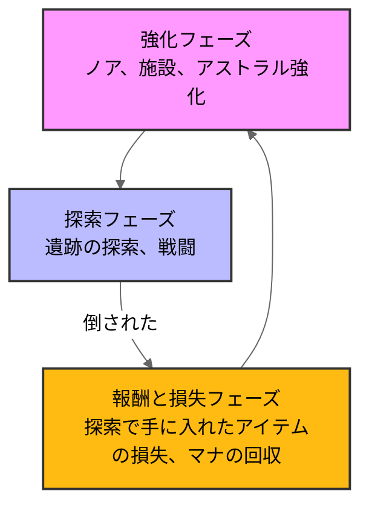

# リトルノア　楽園の後継者

## ゲーム概要と選定理由
### ゲーム概要
錬金術の天才ノアが古代遺跡を大冒険する、お手軽ローグライトアクション。\
錬金術で生み出す40種以上の仲間たちによる爽快なコンボ攻撃が楽しい。\
仲間の出撃順を変えて、突進、打ち上げ、追い打ち、遠距離など攻撃の流れを自由にカスタマイズ！\
(steamstoreページより)

###選定理由
cygamesの買い切りゲームを初めてプレイしたから。\
シンプルながら面白い体験ができる設計がされていたから。\

## 分析の流れ
### 1.ゲームループ
ゲームのコアループ・メタループを図解

### 2.おもしろさのポイント
私が考えるこのゲームの面白さの核心

### 3.ターゲットプレイヤーと体験設計
誰のためにどんな体験を届けるゲームか

### 4.考察・まとめ
私がゲームから得た気づきをまとめる

## 1.ゲームループ
### ループ図解

方舟で強化をして探索、そして倒されたらマナを回収してまた強化とシンプルなゲームループとなっています。\
一見シンプルなループとなっているがプレイヤーが面白いと感じる工夫がゲーム内では為されています。\

## 2.おもしろさのポイント
このゲームでは倒されてしまった場合、いくらレアな装備やアストラルを持っていたとしてもただのマナへと変換されてしまうという無慈悲な仕様となっています。\
ただ私はこの無慈悲な仕様こそがこのゲームの面白さの核心だと考えました。\

### リスク
このゲームは進めていくほど緊張感がでてくる設計となっています。\
このような体験ができるのはこのゲームに存在するリスクによって支えられています。\
 
このゲームを攻略するには「強い装備、アストラルを入手する」、「ステージを進めていく」の2つの要素が必須となってきます。\
この2つの要素は探索を進めるごとに充実していくものだが、それと同時に一度倒されてしまったら全て失ってしまうものでもあります。\

この「全て失ってしまう」という仕様がこのゲームの最大のリスクであると同時に、ゲーム体験に強い緊張感を与える要因になっています。\

例えば、プレイヤーが自分にとって理想的なアストラル編成を完成させた場合、大きな満足感を得られる。\
しかし同時に、その編成を失う可能性が常に付きまとうため、プレイヤーは強い緊張感を抱えたままプレイを続けることになる。\

つまり、探索を進める成果は徐々に大きくなり、それに比例して倒されたときの損失も増大していくということになります。\
このような仕組みを実現しているのがこのゲームのリスクであり、ゲーム体験を底上げしている設計でもあります。\

### リターン
このゲームには「全てを失う」という大きなリスクが存在する一方で、それに対応する明確なリターンとして「マナ」が設計されています。\
マナは、プレイヤーが探索中に倒された際、所持していたアイテムやそのレアリティに応じて獲得できる資源。\
つまり、失敗は単なる損失ではなく、次回以降のプレイに活かすことのできる成果として蓄積されるのです。\

獲得したマナは、方舟の強化(プレイヤーの強化)に使用できます。\
これにより、プレイヤーの基礎能力の向上に加え、新たなアクションの解放やポーション数の増加など、多様な強化が可能になります。
これらの強化は探索の安定性を高め、結果として再挑戦時の成功率を向上させる役割を持ちます。\

このように、このゲームにおけるマナは「失敗を次の成功につなげる仕組み」として機能しています。\
プレイヤーはリスクを負って探索を進めるほど、たとえ途中で倒されたとしても確実に成長していくことができます。\

その結果、「全てを失う」というリスクは完全な喪失ではなく、「一時的な後退」に変換することができます。\
この設計により、プレイヤーは失敗に対する心理的な抵抗を軽減しつつ、継続的に挑戦する動機を維持することができます。\

したがって、マナというリターン要素は、リスクの緊張感を保ちながらもプレイヤーの成長実感と快適性を両立させる、本作のゲーム体験の中核を担う仕組みであると考えます。

## 3.ターゲットプレイヤーと体験設計
このゲームのターゲット層は\
シリーズファン
アクションゲーム好き(初心者から上級者)

